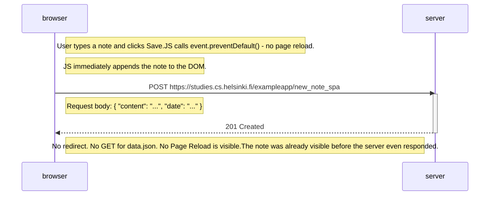

```mermaid
sequenceDiagram
    participant browser
    participant server
    
    Note right of browser: User types a note and clicks Save.JS calls event.preventDefault() - no page reload.

    Note right of browser: JS immediately appends the note to the DOM.
    browser->>server: POST https://studies.cs.helsinki.fi/exampleapp/new_note_spa
    activate server
    Note right of browser: Request body: { "content": "...", "date": "..." }
    server-->>browser: 201 Created
    deactivate server
    
    Note right of browser: No redirect. No GET for data.json. No Page Reload is visible.The note was already visible before the server even responded.
```